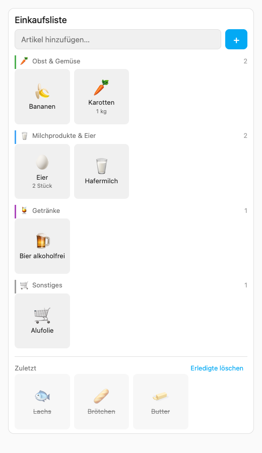

# Grocery Tiles Card

Eine Home-Assistant-Lovelace-Karte, die eine beliebige `todo.*`-Entity als Emoji-Kachel-Grid
nach Einkaufskategorien zeigt (Bring!-Stil). Antippen hakt ab, erledigte Artikel landen als
graue Kacheln unter „Zuletzt" und lassen sich mit einem Tap zurückholen.



- Kategorie und Emoji werden **clientseitig aus dem Artikelnamen** abgeleitet (DE/EN/IT-Keywords)
  und nie in die Liste zurückgeschrieben.
- Mengen wie `2 Stück Eier` oder `1 kg Karotten` werden erkannt und klein unter dem Namen angezeigt.
- Vorschlags-Chips beim Tippen (zuerst aus der eigenen Liste, dann aus der Emoji-Datenbank).
- Duplikat-Schutz: ein bereits offener Artikel wird nicht doppelt angelegt, ein erledigter wird reaktiviert.
- Long-Press auf eine Kachel: Umbenennen oder Löschen.
- Kein Build-Schritt, keine Abhängigkeiten, HA-Theme-Variablen (Dark Mode inklusive).

## Installation (HACS)

1. HACS → Integrationen/Dashboard → Menü oben rechts → **Benutzerdefinierte Repositories**.
2. Repository-URL dieses Repos eintragen, Kategorie **Dashboard** (Plugin), hinzufügen.
3. „Grocery Tiles Card" installieren. HACS legt die Ressource
   `/hacsfiles/ha-grocery-tiles-card/grocery-tiles-card.js` automatisch an.
4. Karte im Dashboard hinzufügen: „Grocery Tiles Card" im Karten-Picker oder per YAML.

## Konfiguration

| Key | Typ | Default | Bedeutung |
|---|---|---|---|
| `entity` | string | Pflicht | `todo.*`-Entity |
| `title` | string | `''` | Kopfzeile, leer = keine |
| `columns` | number | auto | feste Spaltenzahl; auto = so viele Kacheln (min. 96 px) wie passen |
| `show_recent` | bool | `true` | Bereich „Zuletzt" mit erledigten Artikeln |
| `recent_limit` | number | `30` | sichtbare graue Kacheln, Rest hinter „mehr anzeigen" |
| `show_clear_completed` | bool | `true` | Button „Erledigte löschen" |
| `overrides` | list | `[]` | eigene Zuordnungen, s. u. (nur per YAML) |

Alle Optionen außer `overrides` sind auch im visuellen Editor einstellbar.

```yaml
type: custom:grocery-tiles-card
entity: todo.mealie_einkaufsliste
title: Einkaufsliste
overrides:
  - match: tiptoi
    category: other
    emoji: 🐘
```

`match` ist ein Substring (Groß-/Kleinschreibung egal) und gewinnt vor der eingebauten
Datenbank. `category` ist eine der IDs `fruits_vegetables`, `dairy_eggs`, `meat_fish`,
`bread_bakery`, `pasta_grains`, `frozen`, `beverages`, `other`.

## Hinweis Mealie

Die Karte ändert den Namen eines Artikels nie von selbst, sie schaltet nur den Status um.
Wer einen Artikel über das Long-Press-Menü **umbenennt**, sollte wissen: Die Mealie-Integration
von Home Assistant macht aus einem Rezept-/Lebensmittel-Eintrag dann eine reine Notiz
(Verknüpfung zum Lebensmittel und Menge gehen in Mealie verloren).

## Entwicklung

Reine Logik (`food-db.js`) testen: `node --test food-db.test.mjs`.
Rendering ohne Home Assistant prüfen: `node test/shot.mjs` erzeugt `test/harness.png`
(Headless-Chromium über playwright-core, Pfade in `test/shot.mjs`).

## Lizenz

MIT
